# ER_DIAGRAM.md

> **Status:** Authoritative — reflects the implemented database schema after Phase 1 (migrations 0001–0008).
> **Source of truth:** Alembic migrations `0002_reference_tables` through `0008_career_record_indexes_constraints` and the corresponding SQLAlchemy model files in `backend/fastapi-app/app/models/`.
> **Decisions:** D-003–D-010, D-017–D-029, D-036, D-040–D-049.
> **Do not modify** this document independently of the migrations — both must stay in sync.

---

## 1. Mermaid ER Diagram

```mermaid
erDiagram

    %% ---------------------------------------------------------------
    %% REFERENCE / TAXONOMY TABLES  (migration 0002)
    %% ---------------------------------------------------------------

    STUDY_PROGRAM {
        int     program_id      PK
        varchar program_name    UK "NOT NULL, max 200"
        varchar degree_level       "NOT NULL, max 50"
        bool    is_ftmm_valid      "NOT NULL, DEFAULT false"
        timestamptz created_at     "NOT NULL, DEFAULT now()"
    }

    INDUSTRY {
        int     industry_id     PK
        varchar industry_name   UK "NOT NULL, max 200"
        varchar sector_name        "NOT NULL, max 200"
        varchar taxonomy_code      "NULLABLE, max 50"
        timestamptz created_at     "NOT NULL, DEFAULT now()"
    }

    LOCATION {
        int     location_id     PK
        varchar country            "NOT NULL, max 100"
        varchar province           "NULLABLE, max 100"
        varchar city               "NULLABLE, max 100"
        varchar region             "NULLABLE, max 100"
        timestamptz created_at     "NOT NULL, DEFAULT now()"
    }

    CAPTURE_SOURCE {
        int     source_id       PK
        varchar source_type     UK "NOT NULL, max 100"
        int     trust_tier         "NOT NULL"
        timestamptz created_at     "NOT NULL, DEFAULT now()"
    }

    %% ---------------------------------------------------------------
    %% REFRESH_SNAPSHOT  (migration 0003)
    %% ---------------------------------------------------------------

    REFRESH_SNAPSHOT {
        int     snapshot_id     PK
        varchar quarter_label   UK "NOT NULL, max 20  e.g. '2025-Q1'"
        date    refresh_date       "NOT NULL"
        text    notes              "NULLABLE"
        timestamptz created_at     "NOT NULL, DEFAULT now()"
    }

    %% ---------------------------------------------------------------
    %% SECURITY / RBAC TABLES  (migration 0004)
    %% ---------------------------------------------------------------

    ROLE {
        int     role_id         PK
        varchar role_name       UK "NOT NULL, max 50"
        timestamptz created_at     "NOT NULL, DEFAULT now()"
    }

    PERMISSION {
        int     permission_id   PK
        varchar permission_name UK "NOT NULL, max 100"
        text    description        "NULLABLE"
        timestamptz created_at     "NOT NULL, DEFAULT now()"
    }

    ROLE_PERMISSION {
        int     id              PK
        int     role_id         FK "NOT NULL"
        int     permission_id   FK "NOT NULL"
    }

    APP_USER {
        int     user_id         PK
        uuid    supabase_uuid   UK "NOT NULL  Supabase Auth bridge"
        int     role_id         FK "NOT NULL"
        varchar email              "NULLABLE, max 320"
        bool    is_active          "NOT NULL, DEFAULT true"
        timestamptz created_at     "NOT NULL, DEFAULT now()"
        timestamptz updated_at     "NOT NULL, DEFAULT now()"
    }

    %% ---------------------------------------------------------------
    %% COMPANY TABLES  (migration 0005)
    %% ---------------------------------------------------------------

    COMPANY {
        int     company_id      PK
        varchar canonical_name  UK "NOT NULL, max 300"
        int     industry_id     FK "NULLABLE"
        int     location_id     FK "NULLABLE"
        timestamptz created_at     "NOT NULL, DEFAULT now()"
    }

    COMPANY_ALIAS {
        int     alias_id        PK
        int     company_id      FK "NOT NULL"
        varchar alias_name      UK "NOT NULL, max 300"
        int     source_id       FK "NULLABLE"
        timestamptz created_at     "NOT NULL, DEFAULT now()"
    }

    %% ---------------------------------------------------------------
    %% ALUMNI  (migration 0006)
    %% ---------------------------------------------------------------

    ALUMNI {
        int     alumni_id       PK
        uuid    public_id       UK "NOT NULL, DEFAULT gen_random_uuid()"
        varchar full_name          "NOT NULL, max 300"
        varchar university         "NOT NULL, max 200, DEFAULT 'Universitas Airlangga'"
        int     study_program_id FK "NOT NULL"
        int     graduation_year    "NOT NULL"
        varchar linkedin_url       "NULLABLE, max 500  partial-unique when NOT NULL"
        enum    validation_status  "NOT NULL, DEFAULT 'pending'  {pending|validated|rejected}"
        int     source_id       FK "NOT NULL"
        timestamptz created_at     "NOT NULL, DEFAULT now()"
        timestamptz updated_at     "NOT NULL, DEFAULT now()"
    }

    %% ---------------------------------------------------------------
    %% AUDIT_LOG  (migration 0007)
    %% ---------------------------------------------------------------

    AUDIT_LOG {
        int     audit_id        PK
        varchar table_name         "NOT NULL, max 100"
        varchar record_id          "NOT NULL, max 100  stringified PK"
        varchar action_type        "NOT NULL, max 20  INSERT|UPDATE|DELETE"
        jsonb   old_values         "NULLABLE  null for INSERT"
        jsonb   new_values         "NULLABLE  null for DELETE"
        int     changed_by      FK "NULLABLE  null for system actions"
        timestamptz changed_at     "NOT NULL, DEFAULT now()"
    }

    %% ---------------------------------------------------------------
    %% CAREER_RECORD  (migration 0008)
    %% ---------------------------------------------------------------

    CAREER_RECORD {
        int     career_record_id PK
        int     alumni_id        FK "NOT NULL"
        int     company_id       FK "NOT NULL"
        varchar role_title          "NOT NULL, max 300"
        varchar seniority           "NULLABLE, max 100  assigned Phase 3"
        bool    is_current          "NOT NULL, DEFAULT false"
        int     snapshot_id      FK "NULLABLE  assigned Phase 4"
        int     source_id        FK "NOT NULL"
        date    captured_on         "NULLABLE"
        timestamptz created_at      "NOT NULL, DEFAULT now()"
    }

    %% ---------------------------------------------------------------
    %% RELATIONSHIPS
    %% ---------------------------------------------------------------

    %% Reference → Core
    STUDY_PROGRAM   ||--o{ ALUMNI          : "program_id → study_program_id"
    CAPTURE_SOURCE  ||--o{ ALUMNI          : "source_id → source_id"
    CAPTURE_SOURCE  ||--o{ CAREER_RECORD   : "source_id → source_id"
    CAPTURE_SOURCE  ||--o{ COMPANY_ALIAS   : "source_id → source_id"
    INDUSTRY        |o--o{ COMPANY         : "industry_id → industry_id"
    LOCATION        |o--o{ COMPANY         : "location_id → location_id"

    %% Core entity relationships
    COMPANY         ||--o{ COMPANY_ALIAS   : "company_id → company_id"
    ALUMNI          ||--o{ CAREER_RECORD   : "alumni_id → alumni_id"
    COMPANY         ||--o{ CAREER_RECORD   : "company_id → company_id"
    REFRESH_SNAPSHOT |o--o{ CAREER_RECORD  : "snapshot_id → snapshot_id"

    %% Security / RBAC
    ROLE            ||--o{ ROLE_PERMISSION : "role_id → role_id"
    PERMISSION      ||--o{ ROLE_PERMISSION : "permission_id → permission_id"
    ROLE            ||--o{ APP_USER        : "role_id → role_id"

    %% Audit
    APP_USER        |o--o{ AUDIT_LOG       : "user_id → changed_by"
```

---

## 2. Entity Descriptions

### Reference / Taxonomy Tables (`migration 0002_reference_tables`)

**`STUDY_PROGRAM`**
The approved FTMM study programs registry. `is_ftmm_valid = true` for exactly the five programs that define a valid FTMM alumnus (D-003/D-004); `false` for the catch-all sentinel used to represent out-of-scope programs during validation. Program names are the canonical strings used in deterministic matching (Phase 3).

**`INDUSTRY`**
Flat industry taxonomy with two levels of granularity (D-042): `industry_name` (specific, e.g. "Software Development") used in Industry Distribution analytics, and `sector_name` (parent group, e.g. "Technology") used in Sector Breakdown analytics. `taxonomy_code` is an optional external reference field, nullable, populated by curators if needed. Industry is attached at the company level, not the career-record level (D-018).

**`LOCATION`**
Geographic normalization table (D-019). Rows represent the resolved location of a company. The four fields form a loose hierarchy: `country` (required) → `province` → `city` → `region` (broad descriptor, e.g. "International"). Province and city are nullable to support partial-resolution entries (e.g. country known, city unknown). No composite unique constraint at DB level — curators control the taxonomy.

**`CAPTURE_SOURCE`**
Data provenance registry (D-022, D-049). Each row represents one ingestion source. `trust_tier` is a static, curator-assigned integer: lower value = higher trust (1 = Verified Faculty Record, 2 = Tracer Study, 3 = LinkedIn, 4 = Alumni Form). It is never computed at runtime — it is set at seed time and used only as a human tie-breaker in conflict resolution. `source_type` is unique.

---

### Snapshot Table (`migration 0003_refresh_snapshot`)

**`REFRESH_SNAPSHOT`**
Per-quarter metadata record (D-006, D-007, D-021). `quarter_label` (e.g. `"2025-Q1"`) is unique and identifies one quarterly refresh cycle. All `CAREER_RECORD` rows committed in a given refresh are tagged with that quarter's `snapshot_id`, enabling point-in-time reporting at career-record grain. Master entities (`ALUMNI`, `COMPANY`, `INDUSTRY`, etc.) are not snapshot-versioned.

---

### Security / RBAC Tables (`migration 0004_security_tables`)

**`ROLE`**
Application role definition (D-026, D-036). Four seeded roles: Admin, Data Curator, Faculty Viewer, Read Only. Phase 2 (P2.3) enforces these per request.

**`PERMISSION`**
Granular permission names (D-026, D-036). Fourteen seeded permissions covering alumni, career, company, import, dedup, snapshot, audit, user management, and analytics operations. `permission_name` follows `resource:action` format (e.g. `alumni:read`, `user:manage`).

**`ROLE_PERMISSION`**
Many-to-many join between `ROLE` and `PERMISSION` (D-026). Composite unique constraint on `(role_id, permission_id)` prevents duplicate grants. Phase 2 loads this table at request time to resolve a role's full permission set.

**`APP_USER`**
Application user record, keyed by `supabase_uuid` (D-043). Supabase Auth handles authentication and issues a JWT carrying the user's UUID (`sub`). FastAPI verifies the JWT, looks up the matching `APP_USER` row by `supabase_uuid`, and loads the role for RBAC enforcement (Phase 2, P2.2). `email` is a nullable convenience field — Supabase Auth owns the identity; this is a denormalized copy for admin display only. `updated_at` is kept current by an application-level `onupdate` hook (no DB trigger, per D-039).

---

### Company Tables (`migration 0005_company`)

**`COMPANY`**
Canonical employer registry (D-008, D-017). One row per real-world company. `canonical_name` is unique. `industry_id` and `location_id` are nullable because a company discovered during import may not be classified yet; curators assign them via the company-alias management screen (Phase 4, P4.10). The redundant `country` column present in Schema v1 was intentionally dropped (Q-021 resolution).

**`COMPANY_ALIAS`**
Raw employer string → canonical company mapping (D-017). Every raw text string encountered during import is stored here as an `alias_name` (unique) pointing to one `company_id`. This is how company normalization is achieved: import pipelines look up an alias to find the canonical company. `source_id` records which data source introduced the alias (Q-023 resolution), nullable.

---

### Alumni Table (`migration 0006_alumni`)

**`ALUMNI`**
Core alumni record with all D-040–D-047 deltas applied. Key design decisions embedded:

- `public_id` (UUID, unique, DB-generated via `gen_random_uuid()`) is the stable system identity (D-044).
- `linkedin_url` is nullable and partial-unique — only non-NULL values are constrained to be unique (D-044). This allows alumni without a LinkedIn URL to coexist freely.
- `university` defaults to `'Universitas Airlangga'` (D-040). The explicit-match inclusion rule is enforced in the curator validation workflow (Phase 3), not as a relational entity.
- `validation_status` is a PostgreSQL ENUM `{pending, validated, rejected}` (D-047). Only `validated` rows appear in analytics (D-047/D-048).
- `source_id` (NOT NULL FK → `CAPTURE_SOURCE`) records the primary provenance of the record (D-046).
- `updated_at` is kept current by an application-level `onupdate` hook.

---

### Audit Table (`migration 0007_audit_log`)

**`AUDIT_LOG`**
Immutable mutation trail (D-025, D-036). Every data mutation routed through FastAPI must produce one entry. `old_values` and `new_values` are PostgreSQL JSONB — they store a snapshot of the row before and after the mutation respectively (null for INSERT / DELETE). `changed_by` is a nullable FK to `APP_USER.user_id` — nullable to permit system/script mutations that precede Phase 2 auth wiring. `record_id` is a stringified primary key. The service contract (`write_audit_entry()`) is defined in Phase 1 (P1.14) and wired to business operations in Phase 4 (P4.6).

---

### Career Record Table (`migration 0008_career_record_indexes_constraints`)

**`CAREER_RECORD`**
Per-alumnus career history entry. An alumnus may have many career records (full history preserved). `is_current = true` marks the present role; the partial unique index `uq_career_one_current_per_alumni` ensures exactly one current record per alumnus (D-020/D-029). `seniority` is nullable in Phase 1 — assigned by the normalization pipeline in Phase 3 (P3.9). `snapshot_id` is nullable in Phase 1 — assigned at quarterly commit in Phase 4 (P4.5). `source_id` is NOT NULL per D-041.

---

## 3. Primary Keys

| Table | PK Column | Type | Notes |
|-------|-----------|------|-------|
| `study_program` | `program_id` | `SERIAL` (integer) | Auto-increment |
| `industry` | `industry_id` | `SERIAL` | Auto-increment |
| `location` | `location_id` | `SERIAL` | Auto-increment |
| `capture_source` | `source_id` | `SERIAL` | Auto-increment |
| `refresh_snapshot` | `snapshot_id` | `SERIAL` | Auto-increment |
| `role` | `role_id` | `SERIAL` | Auto-increment |
| `permission` | `permission_id` | `SERIAL` | Auto-increment |
| `role_permission` | `id` | `SERIAL` | Surrogate; business key is `(role_id, permission_id)` UNIQUE |
| `app_user` | `user_id` | `SERIAL` | Auto-increment; `supabase_uuid` is the identity bridge |
| `company` | `company_id` | `SERIAL` | Auto-increment |
| `company_alias` | `alias_id` | `SERIAL` | Auto-increment |
| `alumni` | `alumni_id` | `SERIAL` | Auto-increment; `public_id` UUID is the external-facing stable identity |
| `audit_log` | `audit_id` | `SERIAL` | Auto-increment; append-only |
| `career_record` | `career_record_id` | `SERIAL` | Auto-increment |

---

## 4. Foreign Keys

| Child Table | FK Column | References | `ON DELETE` | Notes |
|-------------|-----------|------------|-------------|-------|
| `role_permission` | `role_id` | `role.role_id` | `CASCADE` | Removing a role removes its permission mappings |
| `role_permission` | `permission_id` | `permission.permission_id` | `CASCADE` | Removing a permission removes its role mappings |
| `app_user` | `role_id` | `role.role_id` | `RESTRICT` | Cannot delete a role while users hold it |
| `company` | `industry_id` | `industry.industry_id` | `SET NULL` | Nullable; classification may not exist at creation |
| `company` | `location_id` | `location.location_id` | `SET NULL` | Nullable; classification may not exist at creation |
| `company_alias` | `company_id` | `company.company_id` | `CASCADE` | Aliases are children of their canonical company |
| `company_alias` | `source_id` | `capture_source.source_id` | `SET NULL` | Nullable; records which source introduced the alias |
| `alumni` | `study_program_id` | `study_program.program_id` | `RESTRICT` | Cannot delete a program while alumni reference it |
| `alumni` | `source_id` | `capture_source.source_id` | `RESTRICT` | NOT NULL; cannot delete a source in use |
| `audit_log` | `changed_by` | `app_user.user_id` | `SET NULL` | Nullable; preserves log entries when a user is removed |
| `career_record` | `alumni_id` | `alumni.alumni_id` | `CASCADE` | Career records are owned by their alumnus |
| `career_record` | `company_id` | `company.company_id` | `RESTRICT` | Cannot delete a company while career records reference it |
| `career_record` | `snapshot_id` | `refresh_snapshot.snapshot_id` | `SET NULL` | Nullable; set at quarterly commit (Phase 4) |
| `career_record` | `source_id` | `capture_source.source_id` | `RESTRICT` | NOT NULL per D-041; cannot delete a source in use |

---

## 5. Unique Constraints and Partial Unique Indexes

| Name | Table | Column(s) | Type | Condition | Notes |
|------|-------|-----------|------|-----------|-------|
| `uq_study_program_name` | `study_program` | `program_name` | UNIQUE constraint | — | Prevents duplicate program rows |
| `uq_industry_name` | `industry` | `industry_name` | UNIQUE constraint | — | Prevents duplicate industry rows; ON CONFLICT target for seed script |
| `uq_capture_source_type` | `capture_source` | `source_type` | UNIQUE constraint | — | ON CONFLICT target for seed script |
| `uq_refresh_snapshot_quarter_label` | `refresh_snapshot` | `quarter_label` | UNIQUE constraint | — | Prevents duplicate quarter labels |
| `uq_role_name` | `role` | `role_name` | UNIQUE constraint | — | ON CONFLICT target for seed script |
| `uq_permission_name` | `permission` | `permission_name` | UNIQUE constraint | — | ON CONFLICT target for seed script |
| `uq_role_permission` | `role_permission` | `(role_id, permission_id)` | UNIQUE constraint | — | Prevents duplicate role→permission grants |
| `uq_app_user_supabase_uuid` | `app_user` | `supabase_uuid` | UNIQUE constraint | — | Enforces 1:1 with Supabase Auth user |
| `uq_company_canonical_name` | `company` | `canonical_name` | UNIQUE constraint | — | One canonical record per real-world employer |
| `uq_company_alias_name` | `company_alias` | `alias_name` | UNIQUE constraint | — | One alias string maps to exactly one canonical company |
| `uq_alumni_public_id` | `alumni` | `public_id` | UNIQUE constraint | — | Stable system identity; DB-generated UUID default |
| `uq_alumni_linkedin_url` | `alumni` | `linkedin_url` | **Partial unique index** | `WHERE linkedin_url IS NOT NULL` | Unique only for non-NULL values (D-044); allows many NULL rows |
| `uq_career_one_current_per_alumni` | `career_record` | `alumni_id` | **Partial unique index** | `WHERE is_current = true` | Enforces exactly one current career record per alumnus (D-020/D-029) |

---

## 6. Filter and Search Indexes

All indexes created in migration `0008_career_record_indexes_constraints` (P1.8).

| Index Name | Table | Column | Purpose |
|------------|-------|--------|---------|
| `idx_alumni_graduation_year` | `alumni` | `graduation_year` | Filter by graduation year (global filter dimension) |
| `idx_alumni_study_program` | `alumni` | `study_program_id` | Filter by study program (global filter dimension) |
| `idx_alumni_validation_status` | `alumni` | `validation_status` | Fast isolation of `validated` rows for analytics |
| `idx_career_company` | `career_record` | `company_id` | Filter career records by company |
| `idx_career_snapshot` | `career_record` | `snapshot_id` | Filter by snapshot quarter (global filter dimension) |
| `idx_career_is_current` | `career_record` | `is_current` | Fast retrieval of current career records |
| `idx_career_alumni` | `career_record` | `alumni_id` | Lookup all career records for one alumnus |
| `idx_company_industry` | `company` | `industry_id` | Filter companies by industry (global filter dimension) |
| `idx_company_location` | `company` | `location_id` | Filter companies by location (global filter dimension) |

**Search indexes covered implicitly:**
- `linkedin_url` — the partial unique index `uq_alumni_linkedin_url` doubles as a lookup index; PostgreSQL uses unique indexes for equality lookups. A separate non-unique index would be redundant.
- `canonical_name` — covered by the `uq_company_canonical_name` unique constraint index.

---

## 7. Cardinalities

| Relationship | Cardinality | Description |
|-------------|-------------|-------------|
| `STUDY_PROGRAM` → `ALUMNI` | 1 : N | One program has many alumni; each alumnus belongs to exactly one program |
| `CAPTURE_SOURCE` → `ALUMNI` | 1 : N | One source can be the primary provenance for many alumni; each alumnus has exactly one source |
| `CAPTURE_SOURCE` → `CAREER_RECORD` | 1 : N | One source can be cited by many career records; each career record has exactly one source (NOT NULL) |
| `CAPTURE_SOURCE` → `COMPANY_ALIAS` | 1 : N (nullable) | One source can introduce many aliases; each alias optionally records its source |
| `INDUSTRY` → `COMPANY` | 1 : N (nullable) | One industry classifies many companies; each company optionally references one industry |
| `LOCATION` → `COMPANY` | 1 : N (nullable) | One location is home to many companies; each company optionally references one location |
| `COMPANY` → `COMPANY_ALIAS` | 1 : N | One canonical company has many raw aliases; each alias belongs to exactly one company |
| `ALUMNI` → `CAREER_RECORD` | 1 : N | One alumnus has many career records (full history); constrained so at most one has `is_current = true` |
| `COMPANY` → `CAREER_RECORD` | 1 : N | One company employs many alumni (via career records); each career record references exactly one company |
| `REFRESH_SNAPSHOT` → `CAREER_RECORD` | 1 : N (nullable) | One quarter snapshot tags many career records; each career record optionally references one snapshot |
| `ROLE` → `ROLE_PERMISSION` | 1 : N | One role has many permission mappings |
| `PERMISSION` → `ROLE_PERMISSION` | 1 : N | One permission is assigned to many roles |
| `ROLE` → `APP_USER` | 1 : N | One role is held by many users; each user holds exactly one role |
| `APP_USER` → `AUDIT_LOG` | 1 : N (nullable) | One user authors many audit entries; each entry optionally records its actor |

---

## 8. Relationship Explanations

### Alumni ↔ Study Program
`ALUMNI.study_program_id` → `STUDY_PROGRAM.program_id` (RESTRICT).
The `is_ftmm_valid` flag on `STUDY_PROGRAM` operationalizes the strict FTMM inclusion rule (D-003/D-004): only alumni whose program has `is_ftmm_valid = true` AND whose `university = 'Universitas Airlangga'` can be `validated`. The seed includes one sentinel row (`Other / Unknown`, `is_ftmm_valid = false`) for use in rejection logic during Phase 3 validation.

### Alumni ↔ Capture Source
`ALUMNI.source_id` → `CAPTURE_SOURCE.source_id` (RESTRICT, NOT NULL).
Records the primary provenance of the alumni record (D-046). The trust tier of the source is a human reference for curators in conflict resolution — it does not automatically affect `validation_status`.

### Career Record ↔ Alumni (with partial unique constraint)
`CAREER_RECORD.alumni_id` → `ALUMNI.alumni_id` (CASCADE).
Career history is preserved append-style: an alumnus accumulates records over time. The partial unique index `uq_career_one_current_per_alumni` (WHERE `is_current = true`) enforces the business rule that exactly one career record per alumnus can represent the current role (D-020). Previous role entries remain with `is_current = false`.

### Career Record ↔ Company (RESTRICT)
`CAREER_RECORD.company_id` → `COMPANY.company_id` (RESTRICT).
`ON DELETE RESTRICT` prevents deletion of a company while career records reference it, protecting referential integrity of the employment history.

### Career Record ↔ Refresh Snapshot (nullable)
`CAREER_RECORD.snapshot_id` → `REFRESH_SNAPSHOT.snapshot_id` (SET NULL).
`snapshot_id` is nullable in Phase 1 because career records are not committed under a quarterly snapshot until Phase 4 (P4.5). A NULL `snapshot_id` indicates a staged or in-progress record not yet formally assigned to a quarter. Point-in-time reporting in Phase 5 filters by `snapshot_id`.

### Company ↔ Industry / Location (nullable, SET NULL)
`COMPANY.industry_id` → `INDUSTRY.industry_id` (SET NULL).
`COMPANY.location_id` → `LOCATION.location_id` (SET NULL).
Both are nullable because a company discovered for the first time during import may not be classified immediately. Curators classify companies via the alias management workflow (Phase 4, P4.10). Industry attribution flows from company to career record to alumnus — it is not stored directly on either `ALUMNI` or `CAREER_RECORD`.

### Company ↔ Company Alias
`COMPANY_ALIAS.company_id` → `COMPANY.company_id` (CASCADE).
The alias table is the normalization engine: every raw employer string encountered during import is resolved to a `canonical_name` via `COMPANY_ALIAS`. The unique constraint on `alias_name` ensures that one raw string maps to exactly one canonical company. On `CASCADE` delete, removing a canonical company removes all its aliases.

### App User ↔ Role (RESTRICT)
`APP_USER.role_id` → `ROLE.role_id` (RESTRICT).
Prevents deletion of a role while users hold it, protecting the RBAC state. The Supabase Auth UUID → `APP_USER` → `ROLE` → `ROLE_PERMISSION` chain is the full Phase 2 authorization path (D-043).

### App User ↔ Audit Log (nullable, SET NULL)
`AUDIT_LOG.changed_by` → `APP_USER.user_id` (SET NULL).
`changed_by` is nullable to accommodate system/script mutations that occur before Phase 2 auth is wired (P1.14 rationale). If an app user row is deleted, audit entries are preserved with `changed_by = NULL` — the audit trail is never destroyed.

### Role ↔ Permission (via Role Permission)
Many-to-many via `ROLE_PERMISSION`. The composite unique constraint `(role_id, permission_id)` prevents duplicate grants. The seeded matrix (docs/architecture/ROLE_PERMISSION_MATRIX.md) maps 4 roles × 14 permissions = 33 active grants. Phase 2 (P2.2) queries this join at request time to resolve the permission set for an authenticated user.

---

## 9. Important Constraint Notes

**`validation_status` is a PostgreSQL native ENUM type** named `validationstatus`, created before the `alumni` table in migration `0006_alumni` and dropped after it in the downgrade. The Python model uses `StrEnum` (`ValidationStatus`) with `create_type=False` — the migration owns the type lifecycle, not the model class. Valid values: `pending`, `validated`, `rejected`. Only `validated` rows enter analytics (D-047/D-048).

**`public_id` UUID** is generated at the database level using `gen_random_uuid()` (built into PostgreSQL 14+, available on Supabase without any extension). The application layer may also supply a UUID value on insert; the DB default applies only when no value is provided.

**`linkedin_url` partial uniqueness** means `NULL` rows are unconstrained — multiple alumni can have no LinkedIn URL. Non-NULL URLs must be globally unique. This is implemented as a partial unique index (not a constraint), so `ON CONFLICT` on `linkedin_url` is not directly available via standard SQL; dedup via LinkedIn URL is handled in application logic (Phase 4, P4.1).

**`is_current` partial unique index** is implemented as a partial unique index (not a table constraint). It does not prevent multiple `is_current = false` rows per alumnus (that is the history). It only prevents a second `is_current = true` row.

**`ondelete` choices are deliberate:**
- `CASCADE`: child records are meaningless without their parent (aliases without a company, career records without an alumnus).
- `RESTRICT`: prevents orphan-creating deletions where the parent is an active taxonomy reference in use.
- `SET NULL`: preserves child records while severing the now-invalid reference (audit log actors, company industry/location classification, career record snapshot assignment).

**`updated_at` columns** on `APP_USER` and `ALUMNI` are kept current via a SQLAlchemy `onupdate` lambda, not a DB-level trigger. This is consistent with D-039 (simplicity; no triggers in Phase 1). Phase 7 hardening (P7.8) may revisit if consistency guarantees are needed for non-ORM updates.

**No composite unique constraint on `LOCATION`** — the `LOCATION` table intentionally has no DB-level composite uniqueness constraint on `(country, province, city)`. The table is expected to grow as curators add new location rows. Deduplication during seeding is handled at the application level in `seed_location.py` using `IS NOT DISTINCT FROM` for NULL-safe comparison.

---

## 10. Migration Map

| Migration | Task(s) | Tables Created | Constraints / Indexes Added |
|-----------|---------|----------------|-----------------------------|
| `0001_baseline` | P0.5 | _(none — no-op)_ | _(none)_ |
| `0002_reference_tables` | P1.1 | `study_program`, `industry`, `location`, `capture_source` | PKs + unique constraints on `program_name`, `industry_name`, `source_type` |
| `0003_refresh_snapshot` | P1.5 | `refresh_snapshot` | PK + unique constraint on `quarter_label` |
| `0004_security_tables` | P1.6 | `role`, `permission`, `role_permission`, `app_user` | PKs + unique on `role_name`, `permission_name`, `(role_id, permission_id)`, `supabase_uuid`; FKs on `role_permission` (CASCADE) and `app_user` (RESTRICT) |
| `0005_company` | P1.2 | `company`, `company_alias` | PKs + unique on `canonical_name`, `alias_name`; FKs with SET NULL and CASCADE |
| `0006_alumni` | P1.3 | `alumni` | PK + unique on `public_id`; partial unique index `uq_alumni_linkedin_url`; FKs with RESTRICT; creates `validationstatus` ENUM (dropped on downgrade) |
| `0007_audit_log` | P1.7 | `audit_log` | PK; FK `changed_by` → `app_user.user_id` (SET NULL) |
| `0008_career_record_indexes_constraints` | P1.4 + P1.8 + P1.9 | `career_record` | PK; 4 FKs (CASCADE, RESTRICT, SET NULL, RESTRICT); partial unique index `uq_career_one_current_per_alumni`; 9 filter/search indexes on `alumni`, `career_record`, `company` |

---

## 11. Table Count Summary

| Category | Tables | Count |
|----------|--------|-------|
| Reference / taxonomy | `study_program`, `industry`, `location`, `capture_source` | 4 |
| Snapshot | `refresh_snapshot` | 1 |
| Security / RBAC | `role`, `permission`, `role_permission`, `app_user` | 4 |
| Company normalization | `company`, `company_alias` | 2 |
| Core entity | `alumni` | 1 |
| Audit | `audit_log` | 1 |
| Career | `career_record` | 1 |
| **Total** | | **14** |
